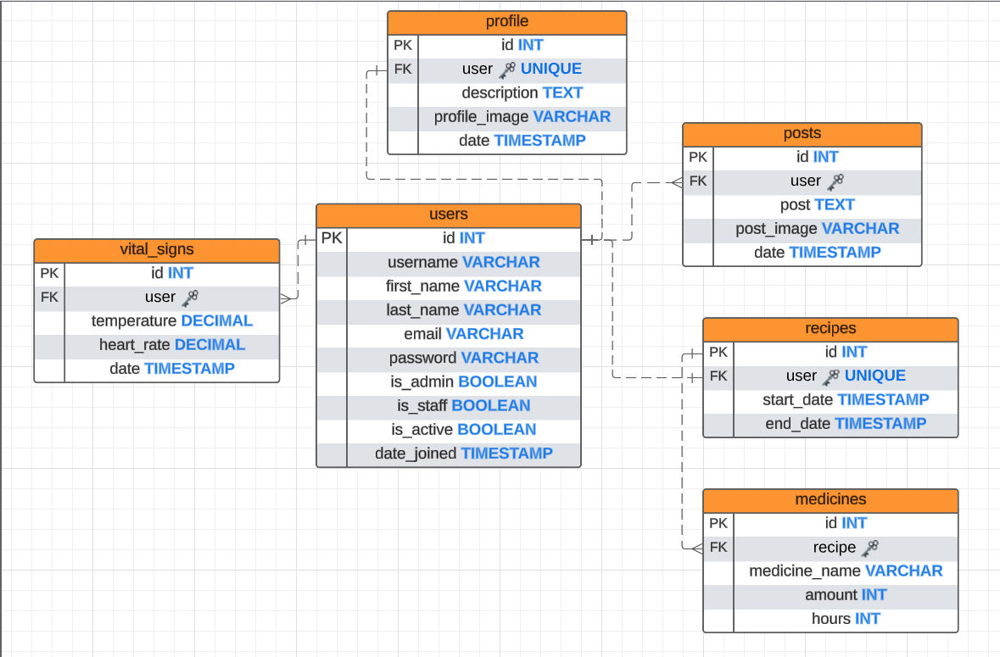
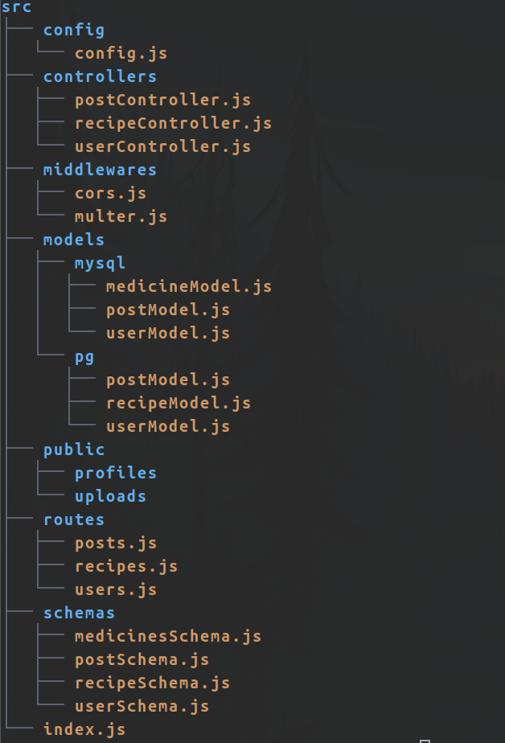

# Luchadores 💪

* Autor: *Jesus Gonzalo Machaca Hancco* (**jsusmachaca**)

**Idioma**
* Español
* [English](./README.md)

> [!IMPORTANT]
> API para la "plataforma Luchadores", un proyecto de código abierto diseñado para **ayudar a personas con enfermedades neoplásicas (cáncer)**

## Funciones ✅
- [x] Registro de usuario.
- [x] Autenticacion de usuario.
- [x] Red social.
- [x] Publicaciones para la comunidad..
- [x] Registro de recetas médicas.
- [ ] Alertas personalizadas al tomar cualquier medicamento..


# Puntos finales de API 🌐

## Puntos finales de autenticación y información del perfil 👤
Para obtener los datos del usuario
- **GET [BASE_URL/api/user]()** *with token*

Para registrar un nuevo usuario
- **POST [BASE_URL/api/user/register]()**  
  cuerpo: 
  ```json
  {
    "username": "tu_nombre_de_usuario",
    "password": "tu_contraseña",
    "confirm_password": "tu_contraseña",
    "first_name": "Tu nombre",
    "last_name": "Tu apellido",
    "email": "tu_correo@email.com"
  }
  ```

Para iniciar sesión
- **POST [BASE_URL/api/user/login]()**  
  cuerpo: 
  ```json
  {
    "username": "tu_nombre_de_usuario",
    "password": "tu_contraseña"
  }
  ```

Para agregar información del usuario
- **POST [BASE_URL/api/user/add-profile]()** *con token*  
  campos opcionales:
  ```json
  {
    "description": "tu_descripción",
    "profile_image": "tu_foto_de_perfil"
  }
  ```

Para editar la información del usuario
- **PUT [BASE_URL/api/user/edit-profile]()** *con token*  
  campos opcionales:
  ```json
  {
    "description": "tu_descripción",
    "profile_image": "tu_foto_de_perfil"
  }
  ```


## Puntos finales de redes sociales 🧑‍🤝‍🧑🧑‍🤝‍🧑
Para obtener todas las publicaciones
- **GET [BASE_URL/api/posts]()**

Para obtener las publicaciones de un usuario
- **GET [BASE_URL/api/posts/user]()** *con token*

Para obtener una publicación especifica
- **GET [BASE_URL/api/posts/get-post?id=*id*]()**

Para eliminar una publicación especifica
- **DELETE [BASE_URL/api/posts/delete?id=*id*]()** *con token*

Para realizar una publicación
- **POST [BASE_URL/api/posts/publish]()** *con token*  
  campos opcionales:
  ```json
  {
      "post": "tu publicación",
      "post_image": "archivo"
  }
  ```

## Puntos finales de recetas 🗒️
Para obtener los medicamentos de la receta
- **GET [BASE_URL/api/recipe/medicines]()** *con token*

Para eliminar una receta
- **DELETE [BASE_URL/api/recipe/del]()** *con token*

Para crear una nueva receta
- **POST [BASE_URL/api/recipe/create]()** *con token*  
  cuerpo:
  ```json
  {
    "start_date": "timedate",
    "end_date": "timedate"
  }
  ```

Para agregar medicamentos en la receta
- **POST [BASE_URL/api/recipes/add]()** *con token*  
  cuerpo:
  ```json
  {
    "medicine_name": "nombre de tu medicamento",
    "amount": int,
    "hours": int
  }
  ```


# Ejecución ✅

### creación de la base de datos:
mysql:
```sql
SOURCE ./database/mysql/luchadores.sql
```
postgresql:
```sql
\i ./database/postgres/luchadores.sql
```
instala las dependencias y ejecuta el servidor (con pnpm):
```sh
pnpm install
pnpm run dev
```

# ESTRUCTURA DEL PROYECTO

## Base de datos: 


## Estructura de directorios:

### Descripción:

- **config:** Contiene archivos de configuración importantes, incluyendo ajustes para la conexión a la base de datos, fuentes permitidas para CORS, creación y validación de tokens, y configuraciones de fecha y hora.
- **controllers:** Contiene controladores responsables de manejar validaciones, autenticación, registro de usuarios y la creación de nuevos registros en la base de datos.
- **middlewares:** Contiene middlewares encargados de CORS y servicios multer para manejar archivos multimedia (multipart/form-data).
- **models:** Contiene los modelos responsables de definir la estructura e interacciones con la base de datos.
- **public:** Se utiliza para almacenar archivos multimedia.
- **routes:** Contiene las rutas de la aplicación, responsables de servir los controladores.
- **schemas:** Contiene esquemas de validación que describen la estructura y reglas de validación para la base de datos.
- **index.js:** El archivo principal encargado de la construcción y ejecución del proyecto.